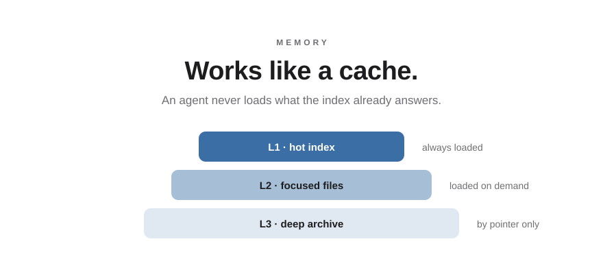

<picture>
  <source media="(prefers-color-scheme: dark)" srcset="assets/hero-dark.svg">
  
</picture>

<picture>
  <source media="(prefers-color-scheme: dark)" srcset="assets/memory-dark.svg">
  
</picture>

<picture>
  <source media="(prefers-color-scheme: dark)" srcset="assets/onemind-dark.svg">
  
</picture>

<picture>
  <source media="(prefers-color-scheme: dark)" srcset="assets/verified-dark.svg">
  
</picture>

 

*It runs my studies and day-to-day, every day — so the data stays private. The design doesn't need to.*

 

## Real code

Two real, runnable pieces of the system:

- [`code/document_pipeline.py`](code/document_pipeline.py) — the single-page document engine (it renders the CV this repo is linked from). One content file in, a design-frozen PDF out; overflowing one page **fails the build**. Ships with sample content — runs as-is.
- [`code/math_verifier.py`](code/math_verifier.py) — the verification contract: re-derive symbolically, answer only `VERIFIED / REFUTED / UNCLEAR`.

<b>Under the hood</b>

 

**The design brief: build it like a processor.**

| In a processor | In this system |
|---|---|
| Execution units | 25+ specialized agents — scoped, least-privilege, isolated context |
| Bus + arbiter | Live coordination board — claim before you write, read before you claim |
| L1 / L2 / L3 caches | Layered memory — hot index, focused files, deep archive |
| Scoreboard / checker | Verification unit — every result re-derived and source-checked before commit |
| Refresh & housekeeping | Nightly maintenance loop — scan, classify by risk, safe fixes only |

*The metaphor is a design compass, not a claim of equivalence — real silicon needs arbitration, hazards, and coherence that markdown never will. Closing that gap is exactly what I'm studying toward.*

**Memory.** One rule: an agent never loads what the index already answers — that alone saves 10–25k tokens per session. Every fact has a single canonical source that wins any contradiction, so hundreds of files can never disagree about the truth.

**Coordination.** Three mechanisms, all plain markdown: a **live board** (claim your area before writing), an **insight wire** (append-only — any lesson reaches every agent, in every future session), and a **write gate** (a new file must prove the fact isn't already covered — update beats create).

**Verification.** Math is re-derived symbolically in a separate process; research passes a source-quality gate (who wrote it, what's their interest, is there a counter-source); rendered documents are read back and checked before delivery. The generator never grades its own work.

**Self-maintenance.** A nightly job scans, classifies findings by risk, and auto-applies only the provably-safe class. Nothing is ever deleted — only demoted. Irreversible actions are designed out.

**Design decisions.**

| Decision | Alternative | Why |
|---|---|---|
| Plain markdown as the data layer | Vector DB / knowledge graph (trialed) | Heavy measured token overhead, no felt recall gain. Grep + a good index is fast, transparent, debuggable with `cat`. |
| One shared memory for all agents | Per-agent silos | Silos fork the truth. One memory + one canonical-facts file = one truth, enforced. |
| Append-only logs, demote-not-delete | In-place edits | History is evidence, and no cleanup routine can destroy knowledge irreversibly. |
| Coordination via files | Message broker / server | Files survive crashes, sync for free, and a human can inspect them with zero tooling. |
| Verifier as a separate, least-privilege agent | Self-checking | A generator checking its own work inherits its own blind spots. Independence is the point. |

**Sanitized artifacts:** [a full agent definition](artifacts/agent-definition.md) · [the live board format](artifacts/coordination-board-sample.md) · [the insight wire](artifacts/insight-wire-sample.md) · [config templates](templates/)

**Stack:** Claude Code · Python 3.11 · sympy · git · launchd · headless Chrome (HTML→PDF) · plain markdown.

 

**Roy Elbar** — Electrical &amp; Computer Engineering, Ben-Gurion University.
Full walkthrough of any subsystem — happily, in an interview.

© 2026 Roy Elbar. Shared for viewing as a portfolio — all rights reserved (<a href="LICENSE">LICENSE</a>).

